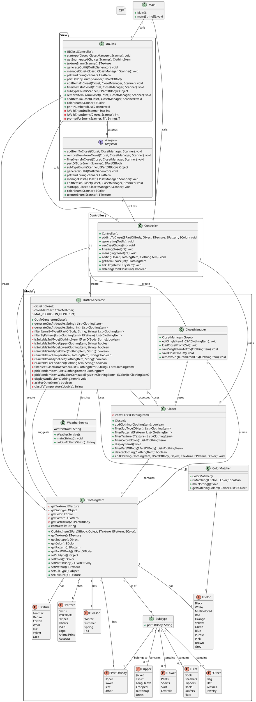

## Class Diagram for Manage my Model.Closet & Generate Outfit 

```plantuml
@startuml

hide empty methods
top to bottom direction

class View.UIClass {
+ UIClass(Controller):
+ startApp(Closet, ClosetManager, Scanner): void
+ getEnumeratedChoices(Scanner): ClothingItem
+ textureEnum(Scanner): ETexture
+ generateOutfit(OutfitGenerator): void
+ manageCloset(Closet, ClosetManager, Scanner): void
+ patternEnum(Scanner): EPattern
+ partOfBodyEnum(Scanner): EPartOfBody
+ editItemsInCloset(Closet, ClosetManager, Scanner): void
+ filterItemsInCloset(Closet, ClosetManager, Scanner): void
+ subTypeEnum(Scanner, EPartOfBody): Object
+ removeItemFromCloset(Closet, ClosetManager, Scanner): void
+ addItemToCloset(Closet, ClosetManager, Scanner): void
+ colorEnum(Scanner): EColor
+ printNumberedList(Closet): void
- isValidInputInt(Scanner, int): int
- isValidInputItems(Closet, Scanner): int
- promptForEnum(Scanner, T[], String): T
  }
interface View.UISystem << interface >> {
+ addItemToCloset(Closet, ClosetManager, Scanner): void
+ removeItemFromCloset(Closet, ClosetManager, Scanner): void
+ filterItemsInCloset(Closet, ClosetManager, Scanner): void
+ partOfBodyEnum(Scanner): EPartOfBody
+ subTypeEnum(Scanner, EPartOfBody): Object
+ generateOutfit(OutfitGenerator): void
+ patternEnum(Scanner): EPattern
+ manageCloset(Closet, ClosetManager, Scanner): void
+ editItemsInCloset(Closet, ClosetManager, Scanner): void
+ startApp(Closet, ClosetManager, Scanner): void
+ colorEnum(Scanner): EColor
+ textureEnum(Scanner): ETexture
  }
  
' Model.Closet class with merged methods
class Model.Closet {
+ Closet():
- items: List<ClothingItem>
+ addClothing(ClothingItem): boolean
+ filterSubType(Object): List<ClothingItem>
+ filterPattern(EPattern): List<ClothingItem>
+ filterTexture(ETexture): List<ClothingItem>
+ filterColor(EColor): List<ClothingItem>
+ displayItems(): void
+ filterPartOfBody(EPartOfBody): List<ClothingItem>
+ deleteClothing(ClothingItem): boolean
+ editClothing(ClothingItem, EPartOfBody, Object, ETexture, EPattern, EColor): void
  }
 
class Model.ClosetManager {
+ ClosetManager(Closet):
+ editSingleItemInCSV(ClothingItem): void
+ loadClosetFromCSV(): void
+ saveSingleItemToCSV(ClothingItem): void
+ saveClosetToCSV(): void
+ removeSingleItemFromCSV(ClothingItem): void
  }
  
 class Model.ClothingItem {
+ ClothingItem(EPartOfBody, Object, ETexture, EPattern, EColor):
- getTexture: ETexture
- getSubtype: Object
- getColor: EColor
- getPattern: EPattern
- getPartOfBody: EPartOfBody
+  itemDetails: String
+  getTexture(): ETexture
+ getSubtype(): Object
+ getColor(): EColor
+ getPattern(): EPattern
+ getPartOfBody(): EPartOfBody
+ setSubtype(): Object
+  setColor(): EColor
+  setPartOfBody(): EPartOfBody
+  setPattern(): EPattern
+  setSubType(): Object
+  setTexture(): ETexture
  }
  
 class Model.ColorMatcher {
+ ColorMatcher():
+ isMatching(EColor, EColor): boolean
+ main(String[]): void
+ getMatchingColors(EColor): List<EColor>
  }
  
 class Controller.Controller {
+ Controller():
+ addingToCloset(EPartOfBody, Object, ETexture, EPattern, EColor): void
+ generatingOutfit(): void
+ useCaseChoice(int): void
+ filteringCloset(int): void
+ managingCloset(int): void
+ editingCloset(ClothingItem, ClothingItem): void
+ getItemChoice(int): ClothingItem
+ linkUISystem(UISystem): void
+ deletingFromCloset(int): boolean
  }

' CSV file
file CSV{
}

' Enumerations for clothing attributes
enum Model.EColor {
Black
White
Multicolored
Red
Orange
Yellow
Green
Blue
Purple
Pink
Brown
Grey
}

enum Model.ETexture {
Leather
Denim
Cotton
Wool
Fur
Velvet
Lace
}

enum Model.EPattern {
Swirls
PolkaDots
Stripes
Florals
Plaid
Logo
AnimalPrint
Abstract
}

enum Model.ESeason {
Winter
Summer
Spring
Fall
}

enum Model.EPartOfBody {
Upper
Lower
Feet
Other
}

' SubType class and related enums
class Model.SubType {
+ partOfBody: String
}

enum Model.EUpper {
Jacket
Tshirt
LongSleeve
Cropped
ButtonUp
Dress
}

enum Model.ELower {
Pants
Shorts
Skirt
Overalls
}

enum Model.EFeet {
Boots
Sneakers
Slippers
Heels
Loafers
Flats
}

enum Model.EOther {
Bag
Hat
Glasses
Jewelry
}

class Main {
+ Main():
+ main(String[]): void
  }

class Model.OutfitGenerator {
- closet : Closet;
- colorMatcher : ColorMatcher;
- MAX_RECURSION_DEPTH : int;
+ OutfitGenerator(Closet):
+ generateOutfit(double, String): List<ClothingItem>
- generateOutfit(double, String, int): List<ClothingItem>
- filterItemsByType(EPartOfBody, String, String): List<ClothingItem>
- filterByPattern(List<ClothingItem>, EPattern): List<ClothingItem>
- isSuitableSubType(ClothingItem, EPartOfBody, String): boolean
- isSuitableSubTypeUpper(ClothingItem, String): boolean
- isSuitableSubTypeLower(ClothingItem, String): boolean
- isSuitableSubTypeOther(ClothingItem, String): boolean
- isSuitableForTemperature(ClothingItem, String): boolean
- isSuitableSubTypeFeet(ClothingItem, String): boolean
- isSuitableForCondition(ClothingItem, String): boolean
- filterFeetBasedOnWeather(List<ClothingItem>, String): List<ClothingItem>
- pickRandomItem(List<ClothingItem>): ClothingItem
- pickRandomItemWithColorCompatibility(List<ClothingItem>, EColor[]): ClothingItem?
- displayOutfit(List<ClothingItem>): void
- askForOtherItem(): boolean
- classifyTemperature(double): String
}
  
' Model.WeatherService class
class Model.WeatherService {
+ WeatherService():
+ main(String[]): void
+ celciusToFarh(String): String
  weatherData: String
  }

' Relationships between classes

Model.Closet "1" -- "*" Model.ClothingItem : contains

Model.ClosetManager "1" -- "1" Model.Closet : uses
Model.ClosetManager  "1" -- "1" Model.ClothingItem : "«create»"

Model.OutfitGenerator -- Model.WeatherService : fetches
Model.OutfitGenerator -- Model.Closet : accesses
Model.OutfitGenerator -- Model.ClothingItem : suggests
Model.OutfitGenerator "1" -- "1" Model.Closet : uses          
Model.OutfitGenerator "1" -- "0" Model.ColorMatcher : uses
ColorMatcher "1" -- "*" EColor    
ClothingItem "1" -- "1" EColor : has
ClothingItem "1" -- "1" EPattern : has
ClothingItem "1" -- "1" ETexture : has
ClothingItem "1" -- "1" ESeason : has
ClothingItem "1" -- "1" EPartOfBody : has
ClothingItem "1" -- "1" SubType : is of

SubType "1" -- "1" EPartOfBody : belongs to
SubType "1" -- "0..*" EUpper : contains
SubType "1" -- "0..*" ELower : contains
SubType "1" -- "0..*" EFeet : contains
SubType "1" -- "0..*" EOther : contains

Main "1" -- "0" View.UIClass : calls
Main "1" -- "0" Controller.Controller: calls

View.UIClass "1" -- "0" Controller.Controller: calls
View.UIClass "1" -- "0" View.UISystem : extends
View.UIClass  "1" -- "0" Model.ClothingItem : "«create»"          
View.UISystem "1" -- "1" Controller.Controller : utilizes

Controller.Controller "1" -- "0" Model.Closet : uses        
Controller "1" -- "0" Model.ClosetManager : "«create»"
Controller "1" -- "0"  Model.ClothingItem : "«create»"
Controller "1" -- "0" OutfitGenerator : "«create»"
      
@enduml
```

