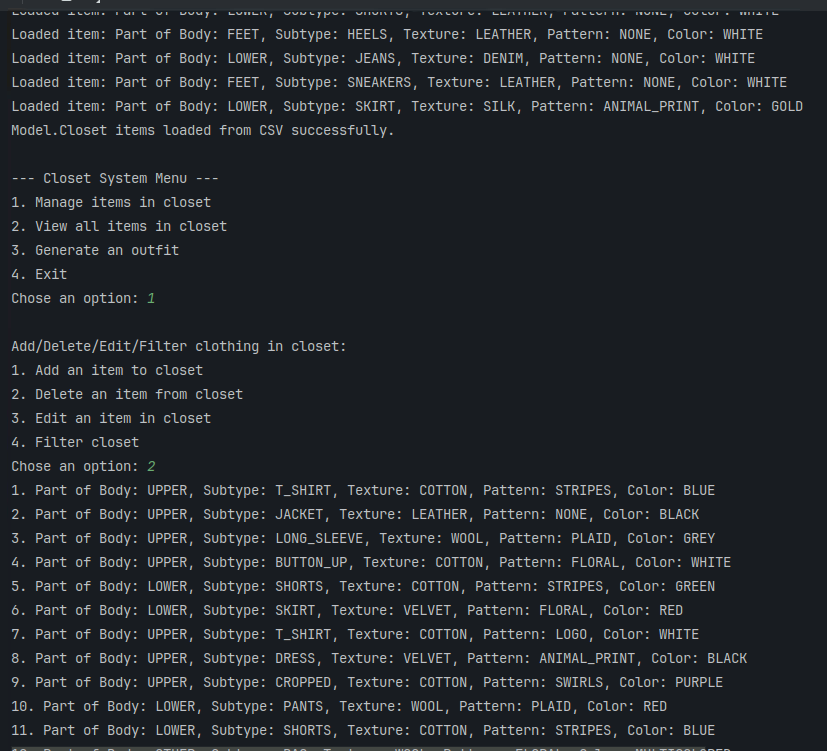
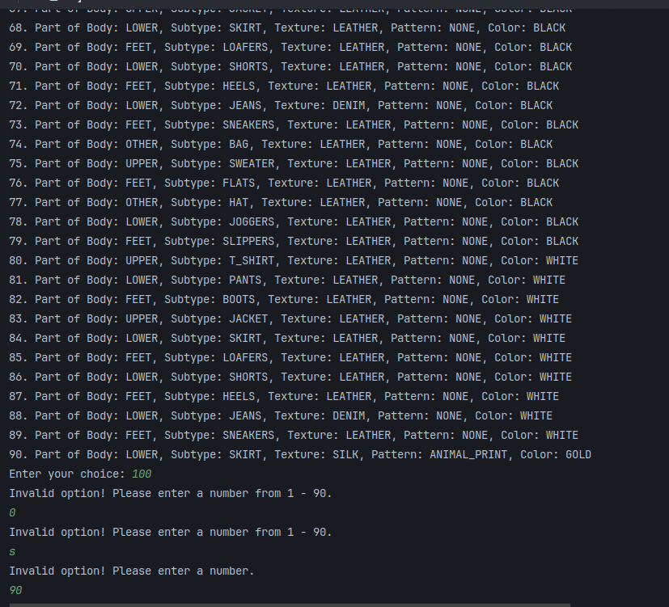
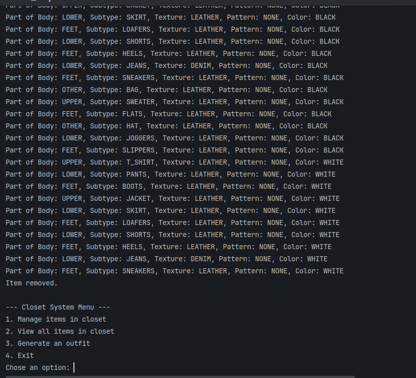
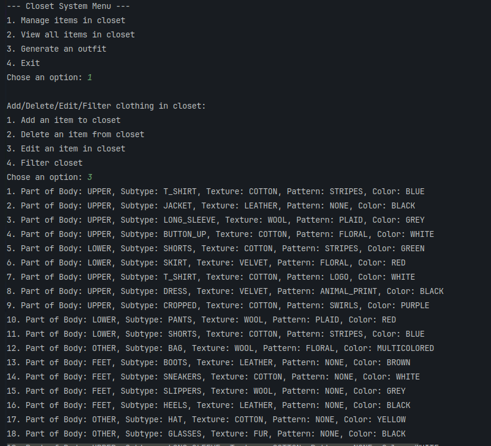
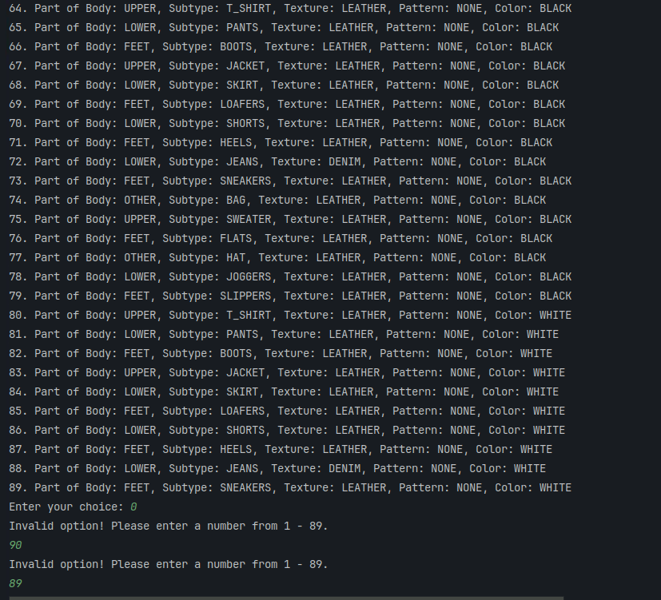
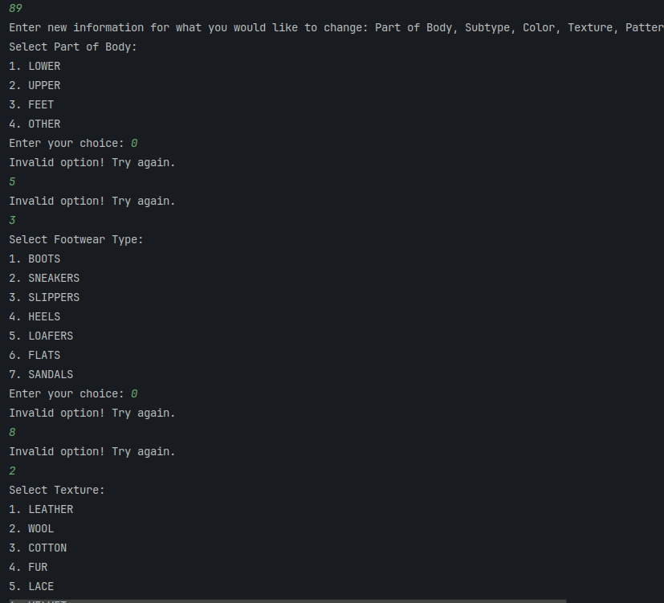
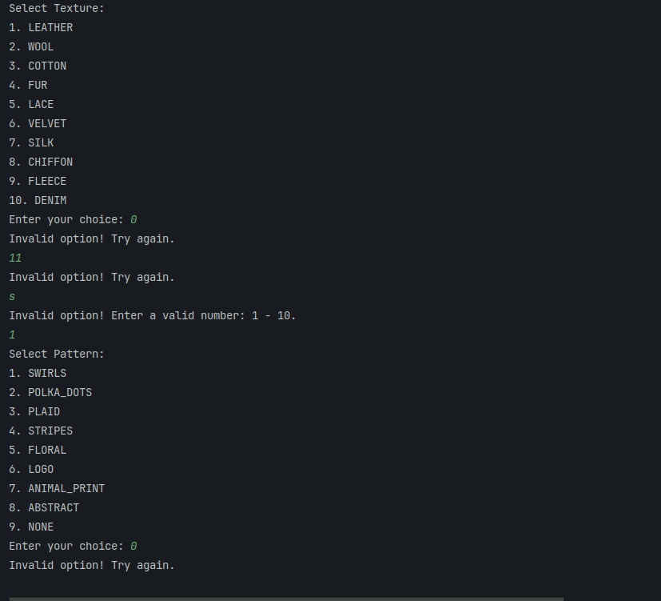
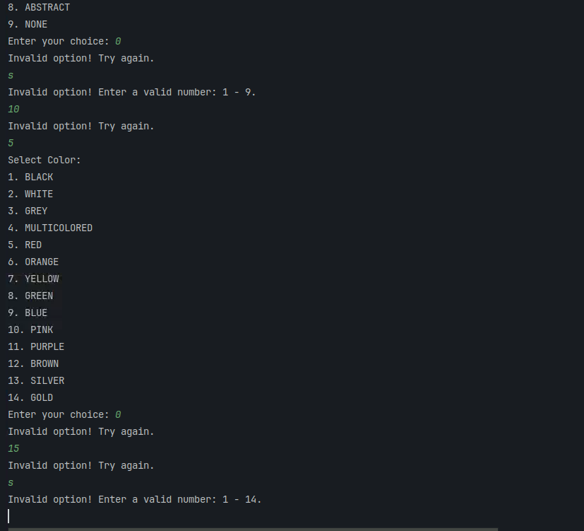
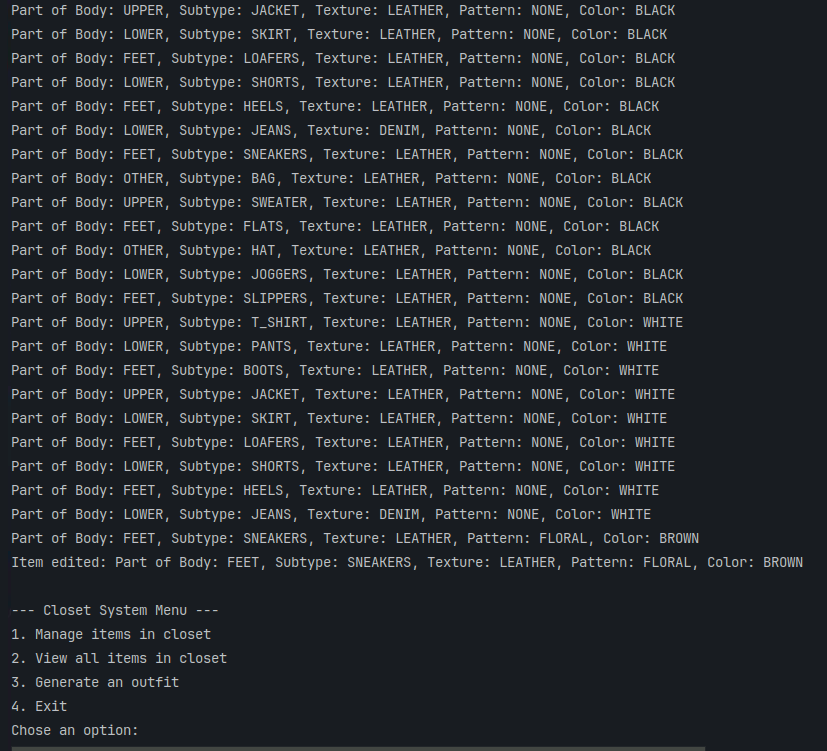

# Test Report
## Overall System
Run Main.main()
Starts by parsing all items from the CSV and di splays them. Shows the Closet System Menu.
Must enter a number from 1-4 or else the system displays an error message and asks you to try again.

## 1. Manage Closet
Enter 1 to go to Manage items in closet.
Enter a number from 1-4 to add, delete, edit or filter, respectively.
- Entering 0 or 5 will result in the system displaying "Invalid option! Please enter a number from 1-4."
- Entering a string will result in the system displaying "Invalid option! Please enter a number."
In both cases you are expected to enter another input, which is then checked for validity.
- 
  
- 
1. Add an item to closet:
For each description: PartOfBody, SubType, Texture, Color, Pattern are asked.
For each category, can only enter 1- max number in that enumerated class. Can only enter a number.

 

Item successfully added and closet displayed.

2. Delete an item from closet:
Hit 2 to delete an item from closet.
Must enter a number from 1- max number of items in closet. Must be a number.

Prints item removed and displays updated closet without removed item.

3. Edit an item in closet:
Press 3 to edit items in closet.
Displays each item in closet.
Must enter a number from 1- max number of items in closet. Must be a number.
For each description: PartOfBody, SubType, Texture, Color, Pattern are asked.
For each category, can only enter 1- max number in that enumerated class. Can only enter a number.

Displays full closet with edited item.
Displays the item edited.

4. Filter closet:
Displays what you can filter closet by: part of body, subtype, texture, pattern, color.
For each filter, can only enter a number from 1- max number of enumerated types inside that enumerated class.
Can only enter a number.

Filter by part of body:

Filter by subtype:

Filter by texture:

Filter by pattern:

Filter by color:

## 2. View Closet
Enter 2 to go to View Closet.

System displays all elements in closet parsed from CSV file.

## 3. Generate Outfit
Enter 3 to go to Generate Outfit.
System displays "Current weather in New York:".
System displays temperature and condition based on Weather API.
System asks if user would like to add an accessory.
User must enter string(any case) that is either "yes" or "no." If user enters a number, no accessory is added.

System displays generated outfit with textures, subtypes based on temperature, texture based on condition, and color matches.

## 4. Exit
Enter 4 to go to Exit (placeholder for next iteration's use case).

System prints "Exiting..."
