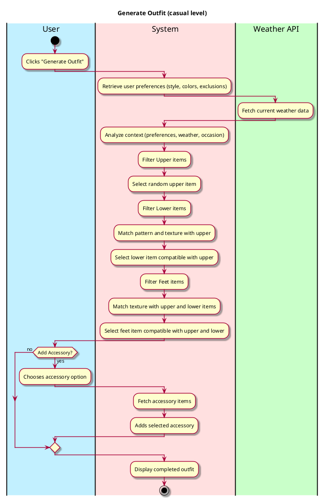
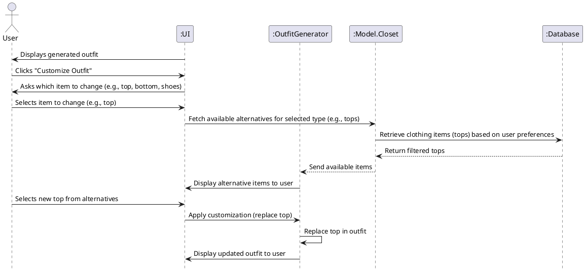
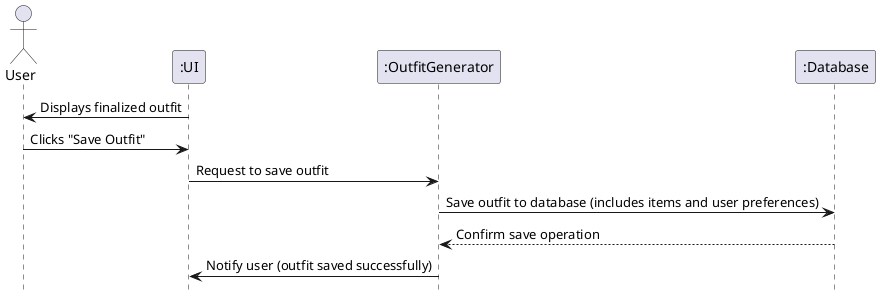
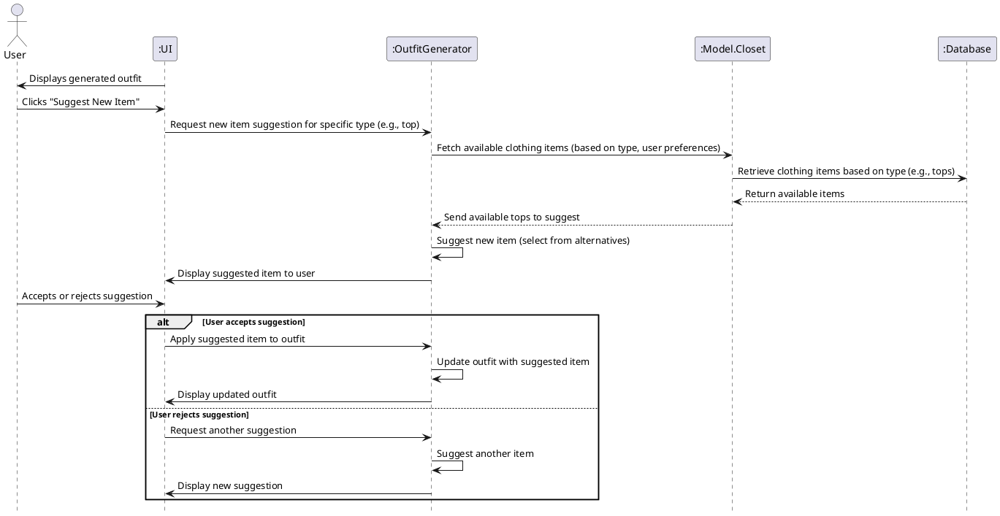
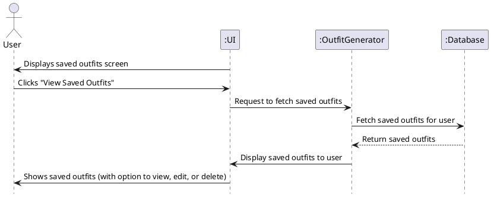
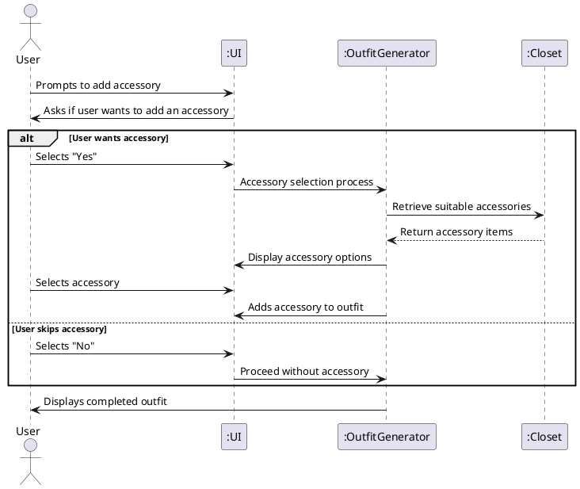

# Generate Outfit

## 1. Primary Actor and Goals
- **User**: Wants to receive a tailored outfit suggestion based on weather conditions, pattern compatibility, texture, and color matching. The user is provided with a completed outfit, with the option to add accessories for a personalized touch.

## 2. Other Stakeholders and Their Goals
- **System**:
    - Provides outfit suggestions by matching closet items based on weather conditions, texture, pattern, and color compatibility.
    - Supports the option to include an accessory in the final outfit for personalization.

## 3. Preconditions
- The user’s virtual closet is set up with categorized clothing items (e.g., Tops, Bottoms, Shoes, Accessories).
- An internet connection is available to fetch weather data if required.

## 4. Post-conditions
- An outfit is generated and displayed to the user.
- The user can choose to add accessories but cannot save the generated outfit (planned as a future feature).

## 5. Workflow

### Main Success Scenario
1. **Click "Generate Outfit" Button**: The user initiates the outfit generation process by clicking the button.
2. **Retrieve Weather Data**: If needed, the system fetches the current weather data.
3. **Filter and Select Upper Item**: The system filters upper items based on weather and randomly selects one.
4. **Match Lower Item**: The system filters lower items, ensuring at most one pattern is present between the upper and lower items, and then matches by texture and color.
5. **Select Feet Item**: The system filters footwear to match both upper and lower selections and the weather condition.
6. **Optional Accessory**: The user is prompted to add an accessory if desired.
7. **Display Outfit**: The system displays the generated outfit to the user, without saving capabilities.

### UML Class Diagram


## Sequence Diagrams

## 1. Main Outfit Generation

```plantuml
@startuml
hide footbox
actor User as user
participant ":UI" as ui
participant ":OutfitGenerator" as outfitGen
participant ":WeatherService" as weather
<<<<<<< HEAD
participant ":Closet" as closet

=======
participant ":Model.Closet" as closet
participant ":Database" as db

user <- ui : Displays "Generate Outfit" screen
user -> ui : Clicks "Generate Outfit" button
ui -> user : Asks for occasion or special conditions
user -> ui : Provides occasion (e.g., work, casual, formal)
ui -> outfitGen : Send user preferences and occasion
outfitGen -> db : Fetch user preferences (style, exclusions, colors)
db --> outfitGen : Return preferences
outfitGen -> weather : Fetch current weather data
weather --> outfitGen : Return weather data
outfitGen -> closet : Fetch available clothing items from closet
closet -> db : Retrieve clothing items based on preferences
db --> closet : Return available clothing items
closet --> outfitGen : Send filtered clothing items

outfitGen -> outfitGen : Analyze context (preferences, weather, occasion, items)
outfitGen -> ui : Generate and display outfit (top, bottom, shoes)

user <- ui : Displays generated outfit with options to customize
user -> ui : Decides to customize (optional)
alt User customizes
    ui -> user : Asks to choose item to change (e.g., top, bottom)
    user -> ui : Selects a new item from closet
    ui -> outfitGen : Send user selection
    outfitGen -> outfitGen : Replace item in outfit
    outfitGen -> ui : Display updated outfit
end

user -> ui : Accepts outfit
ui -> outfitGen : Notify outfit finalized
@enduml


```

### Customize Outfit



###  Saved Outfit



### Suggest New Item



### Retrieve Saved Outfits



### Fetch Weather

```plantuml
@startuml
hide footbox
actor User as user
participant ":UI" as ui
participant ":WeatherService" as weather

user <- ui : Displays generate outfit screen
>>>>>>> refs/remotes/origin/main
user -> ui : Clicks "Generate Outfit"
ui -> weather : Fetch weather data
weather --> ui : Return weather data
ui -> outfitGen : Request outfit generation with weather data
outfitGen -> closet : Retrieve upper items
outfitGen -> outfitGen : Filter by weather, select random upper item
outfitGen -> closet : Retrieve lower items
outfitGen -> outfitGen : Filter by pattern and texture, match with upper
outfitGen -> closet : Retrieve feet items
outfitGen -> outfitGen : Filter by weather, match with upper and lower
outfitGen -> user : Prompt user to add accessory (optional)
alt User adds accessory
    user -> outfitGen : Select accessory
    outfitGen -> closet : Retrieve accessory items
    outfitGen -> outfitGen : Add accessory to outfit
end
outfitGen -> ui : Display completed outfit
@enduml

```
## 2. Accessory Selection (Optional)



## 3. Weather-Based Outfit Generation for a Future Day

```plantuml
@startuml
actor User as user
participant ":UI" as ui
participant ":OutfitGenerator" as outfitGen
participant ":WeatherService" as weather

user -> ui : Clicks "Generate Outfit"
ui -> user : Prompts for weather condition
user -> ui : Enters desired weather condition (e.g., sunny and warm)
ui -> outfitGen : Sends weather condition
outfitGen -> outfitGen : Initiate outfit creation based on user input
outfitGen -> weather : (Optional) Fetch updated weather data
weather --> outfitGen : Return data if applicable
outfitGen -> outfitGen : Filter items based on condition
outfitGen -> user : Generate and display outfit suggestion
@enduml

