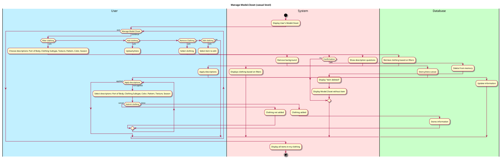
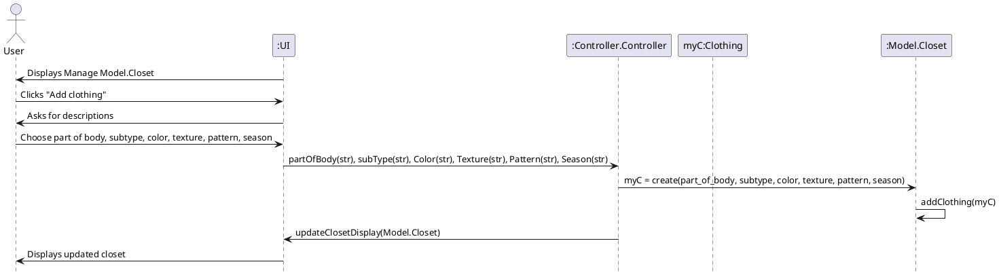
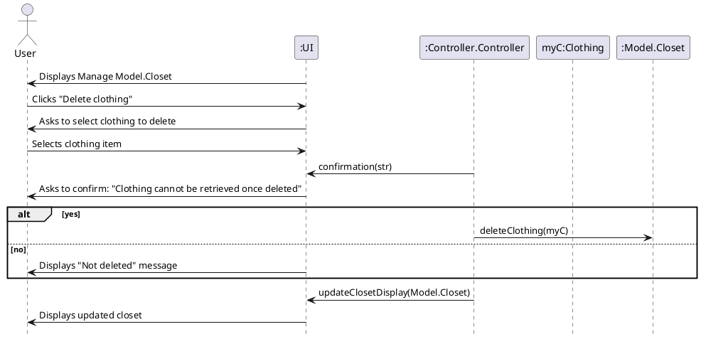
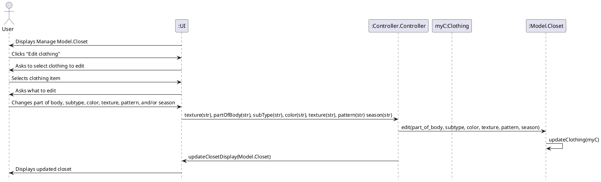
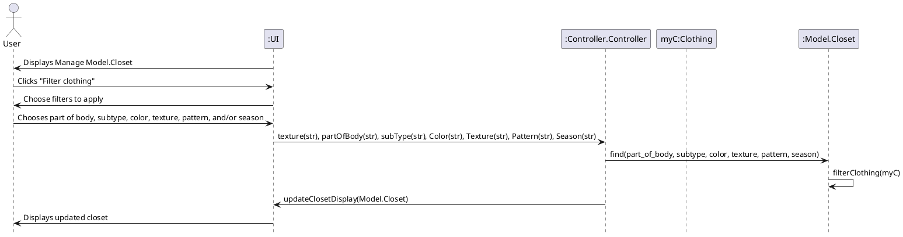

# Manage Closet

## 1. Primary actor and goals

__User__: wants to upload their clothes to their closet, so they can be used to generate an outfit. Wants to organize clothes by Tops, Bottoms, Shoes and Accessories. Wants to filter My Model.Closet based on filters like texture, pattern, color, and type of clothing.

## 2. Other stakeholders and their goals

* __System__: Wants to display uploaded photos of clothes without backgrounds. Wants to use input data to filter clothes based on applied filters. Wants to sort clothes based on the subsections they're classified in.
* __Database__: Wants to store photos uploaded. Wants to store information about each photo (ie: type of clothing, subsection of clothing, texture, pattern, and color).

## 2. Preconditions

* User has logged in with correct username and password.
* User profile with optional user preferences is created.
* User has a working camera and has given the app access to use the camera and photos.
  
## 4. Post-conditions

* Photos are saved without backgrounds(sticker cut-outs).
* Filtered closet can be generated.
* Database has clothes saved based on different inputs.
* My Closet is split into four sections: Tops, Bottoms, Shoes, and Accessories.

## 4. Workflow

## Sequence Diagram: 
### Add Clothing

### Delete Clothing

### Edit Clothing

### Filter Clothing

