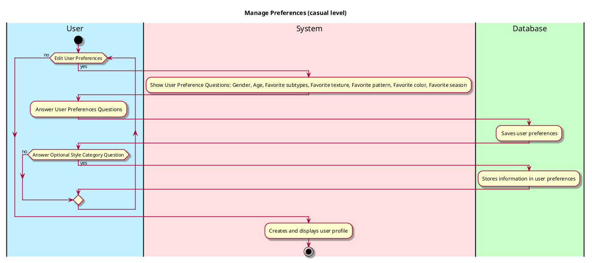

# Manage Preferences

## 1. Primary actor and goals
__User__: wants to save preferences so they don't have to keep re-entering it. Want to view their information on their Profile and be able to update age, gender, style, and preferences.

## 2. Other stakeholders and their goals

* __System__: Wants to deliver accurate outfits based on user preferences. 
* __Database__: Wants to save information so outfit generator doesn't require several different inputs each time.

## 2. Preconditions

* User has an Android.

## 4. Post-conditions

* User is taken to their Profile page.
* User preferences are saved and can be changed.

## 4. Workflow

